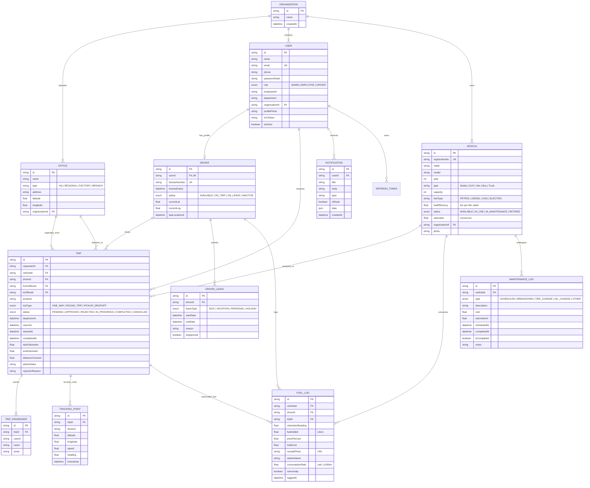

# 🗄️ Vehicle Management System (VMS) — Database Schema & ERD

> **Prepared for AppTriangle Limited Engineering Assessment**  
> **Prisma ORM & PostgreSQL Architecture Guide with Full Mermaid ER Diagram**

---

## 📑 Table of Contents
1. [Visual Entity Relationship Diagram (ERD)](#1-visual-entity-relationship-diagram-erd)
2. [Database Design Principles & Normalization](#2-database-design-principles--normalization)
3. [Comprehensive Table Specifications](#3-comprehensive-table-specifications)
4. [Enum Definitions](#4-enum-definitions)
5. [Indexing & Query Optimization Strategy](#5-indexing--query-optimization-strategy)
6. [Data Integrity & Transaction Rules](#6-data-integrity--transaction-rules)

---

## 1. Visual Entity Relationship Diagram (ERD)



---

## 2. Database Design Principles & Normalization

1. **Third Normal Form (3NF)**:
   - All tables satisfy 1NF (atomic attributes), 2NF (no partial functional dependencies on candidate keys), and 3NF (no transitive functional dependencies).
   - Office locations are abstracted into an independent `Office` entity rather than hardcoding addresses in trips.
2. **Polymorphic Passenger Management**:
   - `TripPassenger` allows recording internal employees as well as external visitors who accompany company officials.
3. **Auditability & Traceability**:
   - Every trip captures initial odometer and final odometer.
   - Every fuel log captures the vehicle's odometer at the exact moment of fueling, ensuring distance validation.
4. **Spatial Geolocation Readiness**:
   - `Office` coordinates (`latitude`, `longitude`) enable map distance calculations.
   - `TrackingPoint` enables breadcrumb polylines on Leaflet / OpenStreetMap.

---

## 3. Comprehensive Table Specifications

### 3.1 `Organization`
| Field | Type | Attributes | Description |
|:------|:-----|:-----------|:------------|
| `id` | CUID / UUID | PK, Default CUID | Unique identifier |
| `name` | String | Not Null | Corporate entity name |
| `createdAt` | DateTime | Default now() | Creation audit timestamp |

### 3.2 `Office`
| Field | Type | Attributes | Description |
|:------|:-----|:-----------|:------------|
| `id` | CUID | PK | Office identifier |
| `name` | String | Not Null | Office name (e.g. "Dhaka Headquarters", "Gazipur Plant") |
| `type` | String | Not Null | `HQ`, `REGIONAL`, `FACTORY`, `BRANCH` |
| `address` | String | Not Null | Physical location address |
| `latitude` | Float | Nullable | Geolocation latitude |
| `longitude` | Float | Nullable | Geolocation longitude |
| `organizationId` | CUID | FK -> Organization(id) | Parent corporate entity |

### 3.3 `User`
| Field | Type | Attributes | Description |
|:------|:-----|:-----------|:------------|
| `id` | CUID | PK | User identifier |
| `name` | String | Not Null | Full legal name |
| `email` | String | Unique, Not Null | Work email used for login |
| `phone` | String | Nullable | Contact number |
| `passwordHash` | String | Not Null | Bcrypt hashed password |
| `role` | Enum Role | Not Null | `ADMIN`, `EMPLOYEE`, `DRIVER` |
| `employeeId` | String | Nullable | Corporate badge ID |
| `department` | String | Nullable | Division (e.g., Logistics, Operations) |
| `organizationId` | CUID | FK -> Organization(id) | Organization membership |
| `profilePhoto` | String | Nullable | Cloud image URL |
| `fcmToken` | String | Nullable | Firebase Cloud Messaging push token |
| `isActive` | Boolean | Default true | Account status switch |

### 3.4 `Driver`
| Field | Type | Attributes | Description |
|:------|:-----|:-----------|:------------|
| `id` | CUID | PK | Driver entity identifier |
| `userId` | CUID | Unique, FK -> User(id) | Relational link to core user credentials |
| `licenseNumber` | String | Unique, Not Null | Government issued driving license number |
| `licenseExpiry` | DateTime | Not Null | License validity date |
| `status` | Enum DriverStatus | Default `AVAILABLE` | `AVAILABLE`, `ON_TRIP`, `ON_LEAVE`, `INACTIVE` |
| `currentLat` | Float | Nullable | Last known GPS latitude |
| `currentLng` | Float | Nullable | Last known GPS longitude |
| `lastLocationAt` | DateTime | Nullable | Timestamp of last received GPS ping |

### 3.5 `Vehicle`
| Field | Type | Attributes | Description |
|:------|:-----|:-----------|:------------|
| `id` | CUID | PK | Vehicle identifier |
| `registrationNo` | String | Unique, Not Null | Official license plate number |
| `make` | String | Not Null | Manufacturer (e.g. Toyota, Nissan) |
| `model` | String | Not Null | Model name (e.g. HiAce, Prado) |
| `year` | Int | Not Null | Manufacturing year |
| `type` | String | Not Null | `Sedan`, `SUV`, `Van`, `Bus`, `Microbus` |
| `capacity` | Int | Not Null | Passenger seating capacity |
| `fuelType` | String | Not Null | `PETROL`, `DIESEL`, `CNG`, `OCTANE`, `EV` |
| `fuelEfficiency` | Float | Not Null | Rated baseline consumption (km per liter) |
| `status` | Enum VehicleStatus | Default `AVAILABLE` | `AVAILABLE`, `IN_USE`, `IN_MAINTENANCE`, `RETIRED` |
| `odometer` | Float | Default 0.0 | Verified current total km reading |
| `organizationId` | CUID | FK -> Organization(id) | Fleet owner |

### 3.6 `Trip`
| Field | Type | Attributes | Description |
|:------|:-----|:-----------|:------------|
| `id` | CUID | PK | Trip identifier |
| `requesterId` | CUID | FK -> User(id) | Employee who submitted the booking |
| `vehicleId` | CUID | Nullable, FK -> Vehicle(id) | Assigned vehicle |
| `driverId` | CUID | Nullable, FK -> Driver(id) | Assigned driver |
| `fromOfficeId` | CUID | FK -> Office(id) | Journey origin point |
| `toOfficeId` | CUID | FK -> Office(id) | Journey destination point |
| `purpose` | String | Not Null | Business justification for the transit |
| `tripType` | Enum TripType | Not Null | `ONE_WAY`, `ROUND_TRIP`, `PICKUP_DROPOFF` |
| `status` | Enum TripStatus | Default `PENDING` | `PENDING`, `APPROVED`, `REJECTED`, `IN_PROGRESS`, `COMPLETED`, `CANCELLED` |
| `departureAt` | DateTime | Not Null | Scheduled journey departure |
| `returnAt` | DateTime | Nullable | Scheduled return time (if round trip) |
| `startedAt` | DateTime | Nullable | Actual driver start timestamp |
| `completedAt` | DateTime | Nullable | Actual journey completion timestamp |
| `startOdometer` | Float | Nullable | Starting km recorded by driver |
| `endOdometer` | Float | Nullable | Ending km recorded by driver |
| `distanceCovered`| Float | Nullable | Calculated difference ($\text{end} - \text{start}$) |
| `adminNotes` | String | Nullable | Internal notes from fleet manager |
| `rejectionReason`| String | Nullable | Explanation provided if rejected |

### 3.7 `FuelLog`
| Field | Type | Attributes | Description |
|:------|:-----|:-----------|:------------|
| `id` | CUID | PK | Fuel entry identifier |
| `vehicleId` | CUID | FK -> Vehicle(id) | Vehicle refueled |
| `driverId` | CUID | FK -> Driver(id) | Driver who carried out refuel |
| `tripId` | CUID | Nullable, FK -> Trip(id) | Associated trip if refueled en route |
| `odometerReading`| Float | Not Null | Odometer reading during refueling |
| `fuelAdded` | Float | Not Null | Liters purchased |
| `pricePerLiter` | Float | Not Null | Unit price in local currency |
| `totalCost` | Float | Not Null | Total receipt amount ($\text{liters} \times \text{unit price}$) |
| `receiptPhoto` | String | Not Null | Cloud photo URL of station receipt |
| `stationName` | String | Nullable | Gas station vendor name & branch |
| `consumptionRate`| Float | Nullable | Calculated actual efficiency (L/100km or km/L) |
| `isAnomaly` | Boolean | Default false | Flagged if deviation exceeds threshold |
| `loggedAt` | DateTime | Default now() | Refueling timestamp |

### 3.8 `TrackingPoint`
| Field | Type | Attributes | Description |
|:------|:-----|:-----------|:------------|
| `id` | CUID | PK | Telemetry coordinate identifier |
| `tripId` | CUID | FK -> Trip(id) | Associated active trip |
| `driverId` | CUID | Not Null | Driver streaming the GPS |
| `latitude` | Float | Not Null | WGS84 Latitude |
| `longitude` | Float | Not Null | WGS84 Longitude |
| `speed` | Float | Nullable | Instantaneous speed (km/h) |
| `heading` | Float | Nullable | Compass bearing (0-360 degrees) |
| `timestamp` | DateTime | Default now() | GPS fix timestamp |

---

## 4. Enum Definitions

```prisma
enum Role {
  ADMIN
  EMPLOYEE
  DRIVER
}

enum TripType {
  ONE_WAY
  ROUND_TRIP
  PICKUP_DROPOFF
}

enum TripStatus {
  PENDING
  APPROVED
  REJECTED
  IN_PROGRESS
  COMPLETED
  CANCELLED
}

enum VehicleStatus {
  AVAILABLE
  IN_USE
  IN_MAINTENANCE
  RETIRED
}

enum DriverStatus {
  AVAILABLE
  ON_TRIP
  ON_LEAVE
  INACTIVE
}

enum LeaveType {
  SICK
  VACATION
  PERSONAL
  HOLIDAY
}

enum MaintenanceType {
  SCHEDULED
  BREAKDOWN
  TIRE_CHANGE
  OIL_CHANGE
  OTHER
}
```

---

## 5. Indexing & Query Optimization Strategy

1. **`Trip(status, departureAt)` Compound Index**:
   - Speeds up admin dashboard queries filtering trips by status (e.g. pending requests sorted chronologically).
2. **`TrackingPoint(tripId, timestamp)` Compound Index**:
   - Essential for rapid retrieval of the historical route polyline for any completed or ongoing trip without scanning millions of telemetry coordinates.
3. **`User(email)` & `Vehicle(registrationNo)` Unique Indexes**:
   - Ensures $O(1)$ lookups during user authentication and fleet license plate searches.
4. **`Driver(userId)` Unique Index**:
   - Guarantees 1-to-1 relationship between a driver profile and authentication identity.

---

## 6. Data Integrity & Transaction Rules

```typescript
// Example: Atomic Assignment to prevent double-booking
await prisma.$transaction(async (tx) => {
  // 1. Verify vehicle is not already IN_USE or IN_MAINTENANCE
  const vehicle = await tx.vehicle.findUniqueOrThrow({ where: { id: vehicleId } });
  if (vehicle.status !== 'AVAILABLE') {
    throw new Error('Vehicle is no longer available');
  }

  // 2. Verify driver is not ON_TRIP or ON_LEAVE
  const driver = await tx.driver.findUniqueOrThrow({ where: { id: driverId } });
  if (driver.status !== 'AVAILABLE') {
    throw new Error('Driver is unavailable or on leave');
  }

  // 3. Update trip record
  const trip = await tx.trip.update({
    where: { id: tripId },
    data: { status: 'APPROVED', vehicleId, driverId }
  });

  // 4. Reserve assets atomically
  await tx.vehicle.update({ where: { id: vehicleId }, data: { status: 'IN_USE' } });
  await tx.driver.update({ where: { id: driverId }, data: { status: 'ON_TRIP' } });

  return trip;
});
```
