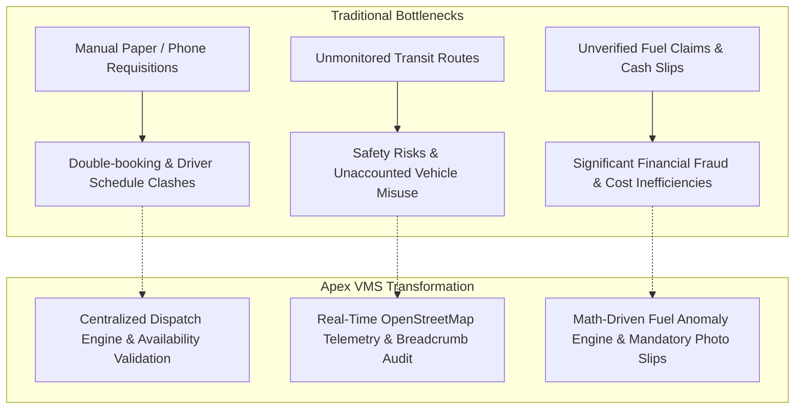
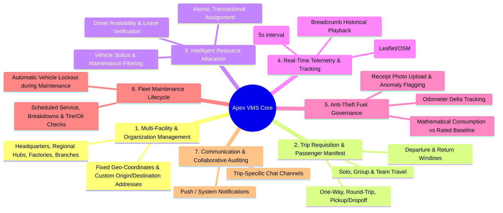
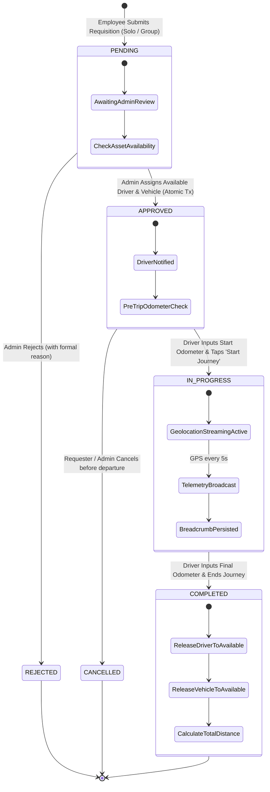

# 📋 Vehicle Management System (Apex VMS)
## Software Requirements Analysis & Specification Document (High-Level SDLC Artifact)

**Author:** Candidate Software Engineer  
**Client / Stakeholder Scenario:** AppTriangle Limited — Multi-Facility Corporate Client  
**Project:** Apex Enterprise Vehicle Management & Real-Time Telemetry Platform  
**Document Version:** 1.0 (Final Architecture & Presentation Baseline)  
**Lifecycle Methodology:** Agile / Iterative SDLC  

---

## Executive Summary

Large-scale corporate enterprises face significant operational friction and financial leakage when managing distributed transportation fleets. In multi-facility organizations comprising **Corporate Headquarters, Regional Distribution Hubs, Manufacturing Factories, and Remote Branches**, ad-hoc vehicle requests over email, phone calls, or paper logbooks lead to:
1. **Asset Double-Booking & Scheduling Collisions**: Inefficient vehicle and driver dispatching.
2. **Zero Fleet Visibility**: Logistics managers have no real-time telemetry on where vehicles are, if passengers have arrived safely, or if journeys run on schedule.
3. **Pervasive Fuel Fraud & Leakage**: Inflated fuel bills and unverified consumption rates without odometer-to-fuel correlation.
4. **Maintenance Neglect**: Vehicles breaking down unpredictably due to lack of scheduled service tracking.

The **Apex Vehicle Management System (VMS)** is an end-to-end, digital fleet dispatch, tracking, and operational governance platform engineered to eliminate these inefficiencies through centralized requisition, real-time GPS telemetry, and automated anti-fraud analytics.

---

## 1. Problem Statement & Business Motivation



### Key Business Goals:
- **100% Fleet Utilization Transparency**: Ensure every vehicle and driver is accounted for (Available, In Transit, On Leave, In Maintenance).
- **Fraud Prevention**: Reduce fuel expenditure by cross-referencing actual odometer delta ($\Delta \text{km}$) with manufacturer fuel efficiency ratings.
- **Rapid Requisition Turnaround**: Reduce approval-to-dispatch latency from hours to seconds.
- **Duty of Care & Safety**: Provide real-time location awareness for personnel traveling to remote manufacturing facilities and cross-country client sites.

---

## 2. Stakeholder Personas & High-Level Needs

| Stakeholder / Persona | Primary Objective | Key Operational Pain Points | Platform Touchpoint |
|:---|:---|:---|:---|
| **Fleet Administrator / Logistics Manager** (Tanvir Hossain) | Oversee entire corporate fleet, approve/reject trips, assign drivers & vehicles without conflicts, monitor active routes, audit fuel costs. | Dealing with phone calls, manual whiteboards, blind spots regarding vehicle locations, fake fuel slips. | **Web Admin Dashboard** (React 18 + Leaflet + Tailwind) |
| **Corporate Employee** (e.g., John Doe, Sarah Smith) | Effortlessly requisition transportation for solo or team business trips across corporate offices, factories, and client sites. | Uncertainty over request status, delayed approvals, difficulty adding traveling colleagues to requisitions. | **Employee Mobile App** (React Native Expo) |
| **Fleet Driver** (e.g., Mohammad Rahim, Abdul Karim) | Receive clear route assignments, record odometer readings, stream live trip coordinates, submit verified fuel receipts, request leave. | Unclear trip details, disputes over fuel expenditure, paper receipt loss, manual route logging. | **Driver Mobile App** (Expo + GPS Geolocation + Camera) |

---

## 3. High-Level Functional Requirements (Grouped by Module)

Rather than enumerating hundreds of low-level lines, the platform is decomposed into **7 core functional domains**:



### Module 1: Organizational & Multi-Facility Hierarchy
- The system must model corporate organizations operating multiple facility types: **Corporate Headquarters (HQ)**, **Regional Logistics Hubs**, **Manufacturing Factories**, and **Regional Branches**.
- Every facility contains geographical coordinates (`latitude`, `longitude`) enabling distance calculation and map rendering.

### Module 2: Trip Requisition & Passenger Manifest Management
- Employees can requisition transport for:
  - **Trip Types**: One-Way, Round-Trip, or Pickup/Dropoff.
  - **Routing**: Office-to-Office, Office-to-Factory, Factory-to-Factory, or custom pickup/dropoff addresses.
  - **Passenger Manifest**: Solo journeys or group travel with searchable corporate colleagues (displaying Colleague Name, Employee ID, Department, Contact info).
- Requisition state follows a strict lifecycle: `PENDING` $\rightarrow$ `APPROVED` $\rightarrow$ `IN_PROGRESS` $\rightarrow$ `COMPLETED` (or `REJECTED` / `CANCELLED`).

### Module 3: Conflict-Free Dispatch & Availability Validation
- The Admin can view verified lists of available assets filtered in real-time:
  - **Drivers**: Excludes drivers currently on active trips (`ON_TRIP`), on approved leave (`ON_LEAVE`), or inactive.
  - **Vehicles**: Excludes vehicles currently in transit (`IN_USE`), undergoing workshop service (`IN_MAINTENANCE`), or retired.
- **Atomic Dispatch Guarantee**: Assignment of vehicle + driver is executed in a single atomic database transaction to prevent double-booking race conditions when multiple dispatchers operate simultaneously.

### Module 4: Real-Time Telemetry & Active Journey Tracking
- While a trip is `IN_PROGRESS`, the Driver's mobile device captures and streams high-accuracy GPS coordinates (`latitude`, `longitude`, `speed`, `heading`) via persistent WebSockets (Socket.io) every 5 seconds.
- The Admin Web Portal visualizes active vehicles on an interactive OpenStreetMap canvas with directional heading markers, live speed telemetry, and route breadcrumbs.
- Coordinates are persisted as `TrackingPoint` records for post-trip route verification and historical auditing.

### Module 5: Anti-Fraud Fuel Audit & Anomaly Detection
- Drivers record fuel purchases at the pump: Odometer Reading, Liters Added, Fuel Price, Station Name, and mandatory Receipt Camera Photo.
- **Automated Verification Engine**:
  $$\text{Actual Consumption (km/L)} = \frac{\text{Current Odometer} - \text{Previous Odometer}}{\text{Fuel Liters Added}}$$
- If the calculated consumption deviates by $>25\%$ from the manufacturer's rated efficiency (`fuelEfficiency`), the record is flagged as `isAnomaly = true` and an instant alert is triggered on the Admin Dashboard for financial investigation.

### Module 6: Driver Leave & Fleet Maintenance Lifecycle
- Drivers can submit time-off requests (`SICK`, `VACATION`, `PERSONAL`, `HOLIDAY`) which, once approved by the Admin, automatically prevent trip assignments during that date range.
- Admins log preventive and corrective maintenance (`SCHEDULED`, `BREAKDOWN`, `TIRE_CHANGE`, `OIL_CHANGE`). Active maintenance automatically sets vehicle status to `IN_MAINTENANCE`, preventing dispatch.

### Module 7: Collaboration & In-Trip Communication
- Every active trip automatically instantiates a dedicated communication channel (`Conversation`) where the Requester, Driver, and Admin can exchange real-time text updates, location pins, and incident reports without leaving the application.

---

## 4. Non-Functional Requirements (NFRs)

| NFR Category | Requirement Specification | Engineering Implementation |
|:---|:---|:---|
| **Performance & Latency** | Live GPS coordinate delivery latency must be $< 300\text{ ms}$. REST API request response times must be $< 150\text{ ms}$ under standard loads. | Socket.io WebSocket rooms for telemetry; database indexed queries on foreign keys and compound status/date indexes. |
| **Data Integrity & Concurrency** | Zero tolerance for asset double-booking (assigning 1 driver or 1 vehicle to 2 concurrent trips). | Prisma `$transaction` locking ensuring acid-compliant updates across `Trip`, `Driver`, and `Vehicle`. |
| **Security & Authorization** | Robust Role-Based Access Control (RBAC). Passwords must be salted & hashed. Tokens must expire. | `bcrypt` (10 rounds) password hashing; JWT stateless access authentication with role verification middleware. |
| **Cross-Platform Accessibility** | Platform must be operable across desktop browsers (Admin) and Android/iOS smartphones (Employee & Driver). | Admin: Responsive React 18 + Vite + Tailwind CSS. Mobile: React Native Expo running on native Android/iOS runtimes. |
| **Auditability & Traceability** | No financial or route data may be silently overwritten; every trip must retain start/end odometer and timestamp audit logs. | Normalized relational PostgreSQL schema with immutable logs (`TrackingPoint`, `FuelLog`, `MaintenanceLog`). |

---

## 5. System State Machine & Lifecycle Flow



---

## 6. Software Development Life Cycle (SDLC) Execution

This project was executed following an **Iterative Agile SDLC framework** across 5 distinct phases:

```
[Phase 1: Domain & Requirements Analysis]
   └── Stakeholder interviews, persona mapping, corporate use-case deconstruction.
[Phase 2: Architectural & Schema Modeling]
   └── PostgreSQL 3NF normalized schema design, Prisma ORM modeling, REST & WebSocket contract definition.
[Phase 3: Core Backend & Real-Time Engine]
   └── Express.js + TypeScript REST micro-services, JWT/RBAC guards, Socket.io telemetry gateway.
[Phase 4: Multi-Client Frontend Development]
   └── Web Admin Portal (React, Vite, Tailwind, Leaflet) + Mobile App (React Native Expo, NativeWind).
[Phase 5: Verification, Data Seeding & Simulation]
   └── Comprehensive database seeding (Offices, Fleet, Employees, Drivers) and live GPS route simulation.
```

---

## 7. Summary for Reviewers

The Apex VMS requirement engineering process guarantees that every line of backend and frontend code directly serves an explicit enterprise need: **governing assets, eliminating financial fraud, securing traveling personnel, and delivering frictionless operational visibility.**
