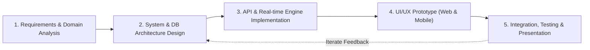
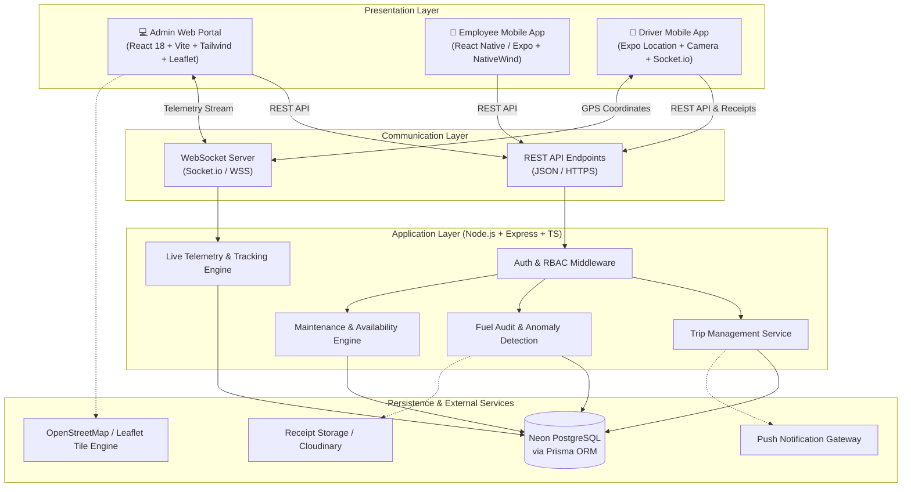
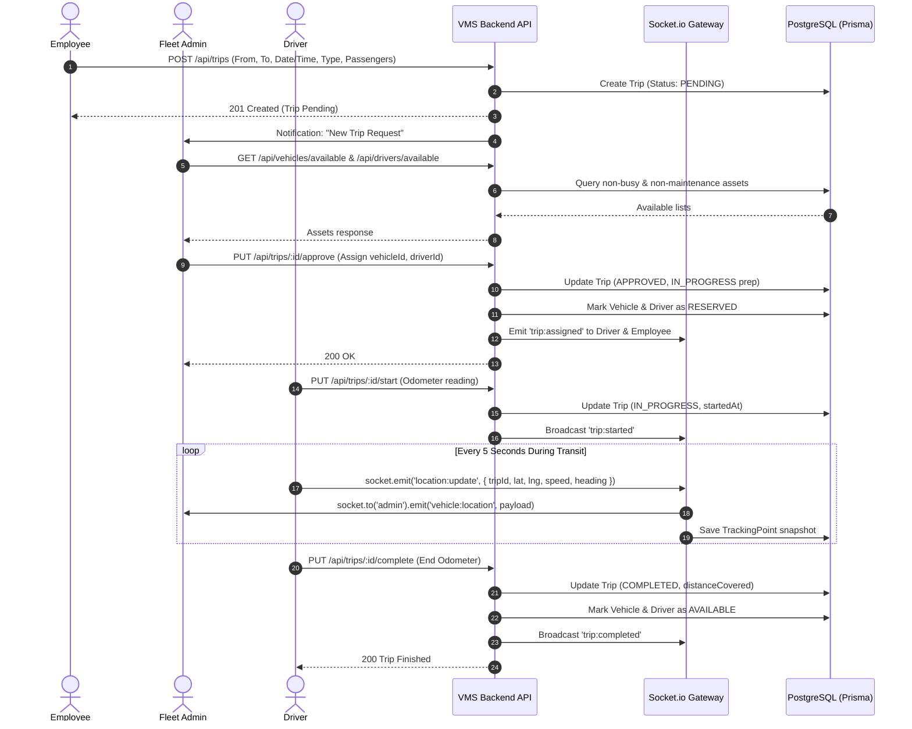
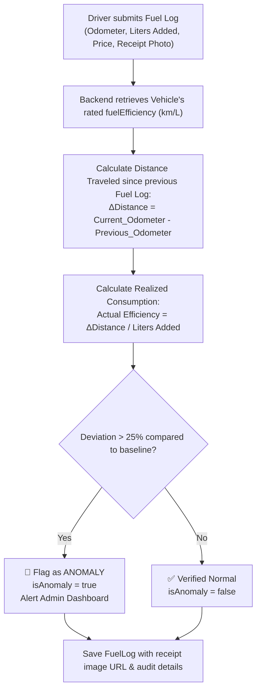
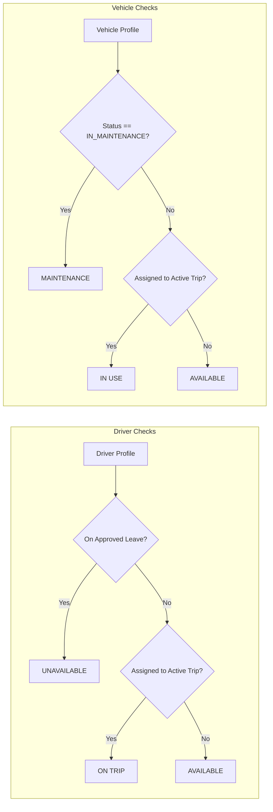
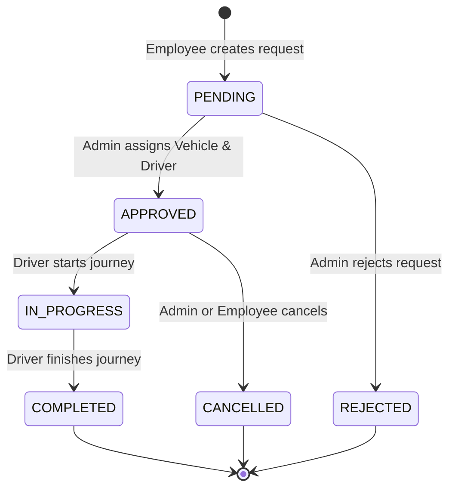

# 🏗️ Vehicle Management System (VMS) — System Architecture & Flow

> **Prepared for AppTriangle Limited Engineering Assessment**  
> **Candidate Documentation: SDLC, Architecture, Sequence Flows, & Design Principles**

---

## 📑 Table of Contents
1. [Software Development Life Cycle (SDLC) Methodology](#1-software-development-life-cycle-sdlc-methodology)
2. [High-Level System Architecture](#2-high-level-system-architecture)
3. [User Roles & Access Control (RBAC)](#3-user-roles--access-control-rbac)
4. [End-to-End System Workflows](#4-end-to-end-system-workflows)
   - 4.1 [Trip Request & Assignment Lifecycle](#41-trip-request--assignment-lifecycle)
   - 4.2 [Live Vehicle GPS Tracking Architecture](#42-live-vehicle-gps-tracking-architecture)
   - 4.3 [Fuel Logging & Anti-Theft Anomaly Detection](#43-fuel-logging--anti-theft-anomaly-detection)
   - 4.4 [Driver & Vehicle Availability Management](#44-driver--vehicle-availability-management)
5. [State Machine Diagrams](#5-state-machine-diagrams)
6. [Real-time WebSocket Protocol Specification](#6-real-time-websocket-protocol-specification)
7. [Security & Data Integrity Decisions](#7-security--data-integrity-decisions)
8. [Interview Walkthrough & Key Talking Points](#8-interview-walkthrough--key-talking-points)

---

## 1. Software Development Life Cycle (SDLC) Methodology

We adopted an **Agile / Iterative SDLC** framework divided into 5 distinct phases:

### Phase Details:
- **Phase 1: Requirements Engineering**: Deconstructed multi-office corporate scenario (HQ, Regional Offices, Factories) with 3 key personas (Admin, Employee, Driver) across solo/group transit, pick-up/drop-off, and one-way/round trips.
- **Phase 2: Architectural & Schema Modeling**: Designed normalized relational schema with strict foreign keys, enum constraints, and spatial coordinates for OpenStreetMap tracking.
- **Phase 3: Core Backend & Telemetry**: Built Express + TypeScript API with Prisma ORM, JWT authentication, and a Socket.io WebSocket gateway for low-latency GPS telemetry.
- **Phase 4: Client Development**: Built a responsive Admin Dashboard (React + Tailwind + Leaflet) and cross-platform mobile interfaces (React Native Expo).
- **Phase 5: Quality Assurance & Demonstration**: Seeded rich mock corporate data, trip routes, and a live GPS simulation engine for real-time interview evaluation.

---

## 2. High-Level System Architecture

The VMS employs a modular **3-Tier Distributed Architecture**:

---

## 3. User Roles & Access Control (RBAC)

| Capability / Resource | Employee | Driver | Admin |
|:----------------------|:--------:|:------:|:-----:|
| Request Trip (Solo / Group / Round-trip) | ✅ | ❌ | ✅ |
| View Personal Trip History | ✅ | ✅ (Assigned) | ✅ (All) |
| Approve / Reject Requests | ❌ | ❌ | ✅ |
| Assign Vehicle & Driver | ❌ | ❌ | ✅ |
| Start / End Journey & Stream GPS | ❌ | ✅ | ❌ |
| View Live Map of Fleet & Speed | ❌ | ❌ | ✅ |
| Submit Fuel Log & Receipt Photo | ❌ | ✅ | ✅ |
| View Fuel Audit & Anomaly Flags | ❌ | ❌ | ✅ |
| Manage Vehicles & Maintenance Logs | ❌ | ❌ | ✅ |
| Apply for Driver Leave | ❌ | ✅ | ✅ (Approve) |

---

## 4. End-to-End System Workflows

### 4.1 Trip Request & Assignment Lifecycle

---

### 4.2 Live Vehicle GPS Tracking Architecture

1. **Driver Device**: Uses `expo-location` high-accuracy background or foreground geolocation.
2. **WebSocket Pipeline**: Connects via Socket.io to the server. Emits coordinates (`lat`, `lng`, `speed`, `heading`, `odometer`, `tripId`).
3. **Server Throttling & In-Memory Cache**: Coordinates are verified against the active trip ID and dispatched immediately to the `admin_fleet` broadcast room.
4. **Persistence Strategy**: To avoid write saturation on PostgreSQL, coordinate breadcrumbs are batched or logged at 5-10s intervals into the `TrackingPoint` table.
5. **Admin Map Visualizer**: Leaflet tile layer displays vehicle marker with custom orientation heading, pulsing speed badge, and polyline breadcrumb trail.

---

### 4.3 Fuel Logging & Anti-Theft Anomaly Detection

To prevent fuel theft and false reimbursement claims, the system applies a dual-check validation formula:

---

### 4.4 Driver & Vehicle Availability Management

---

## 5. State Machine Diagrams

### Trip State Machine

---

## 6. Real-time WebSocket Protocol Specification

| Event Name | Direction | Payload | Purpose |
|:-----------|:---------:|:--------|:--------|
| `join:admin` | Client ➔ Server | `{ token: string }` | Authenticates Admin to receive all fleet broadcasts |
| `join:trip` | Client ➔ Server | `{ tripId: string }` | Joins a specific trip channel (Employee/Driver) |
| `location:update` | Driver ➔ Server | `{ tripId, vehicleId, lat, lng, speed, heading, timestamp }` | Live GPS coordinate push |
| `vehicle:location` | Server ➔ Admin | `{ tripId, vehicleId, driverId, lat, lng, speed, heading, registrationNo }` | Live telemetry broadcast to Admin Leaflet map |
| `trip:status_change` | Server ➔ Clients | `{ tripId, status, updatedBy }` | Instant UI reactive update without polling |

---

## 7. Security & Data Integrity Decisions

1. **Role-Based Guards**: Express middleware verifies JWT signatures and ensures drivers cannot access admin resources, and employees cannot mutate fleet states.
2. **Atomic State Updates**: When an admin approves a trip and assigns resources, a **Prisma `$transaction`** guarantees that:
   - Trip is updated to `APPROVED`
   - Vehicle status switches to `IN_USE`
   - Driver status switches to `ON_TRIP`
   - Prevents double-booking race conditions if multiple admins are online.
3. **Audit Trails**: All odometer mutations, timestamps, fuel receipts, and leave requests have relational foreign keys and non-editable history logs.

---

## 8. Interview Walkthrough & Key Talking Points

When presenting this architecture to AppTriangle Limited:
1. **Explain the Corporate Context**: Emphasize how multiple offices (HQ, Regional Offices, Factories) are modeled cleanly with geolocation coordinates.
2. **Highlight Anti-Theft Fuel Verification**: Explain the mathematical anomaly detection ($\Delta \text{km} / \text{Liters}$) paired with mandatory receipt photo uploads.
3. **Demonstrate Real-time Architecture**: Show that WebSockets (Socket.io) prevent unnecessary DB polling, saving server CPU and battery on mobile devices.
4. **Demonstrate Race Condition Prevention**: Mention Prisma `$transaction` preventing asset double-booking.
5. **Showcase Modern Stack**: TypeScript across the entire ecosystem, Tailwind + shadcn/ui for clean enterprise design, and Expo for native deployment.
